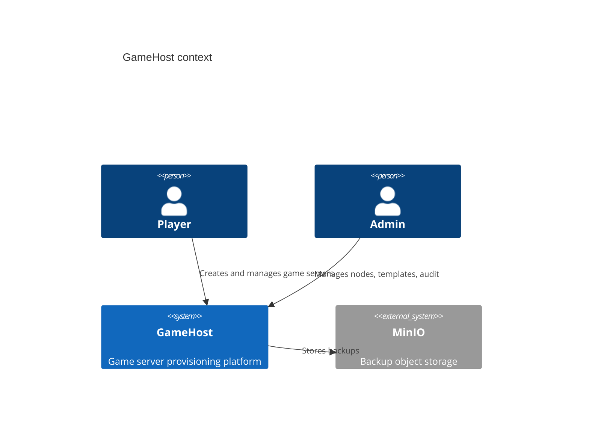
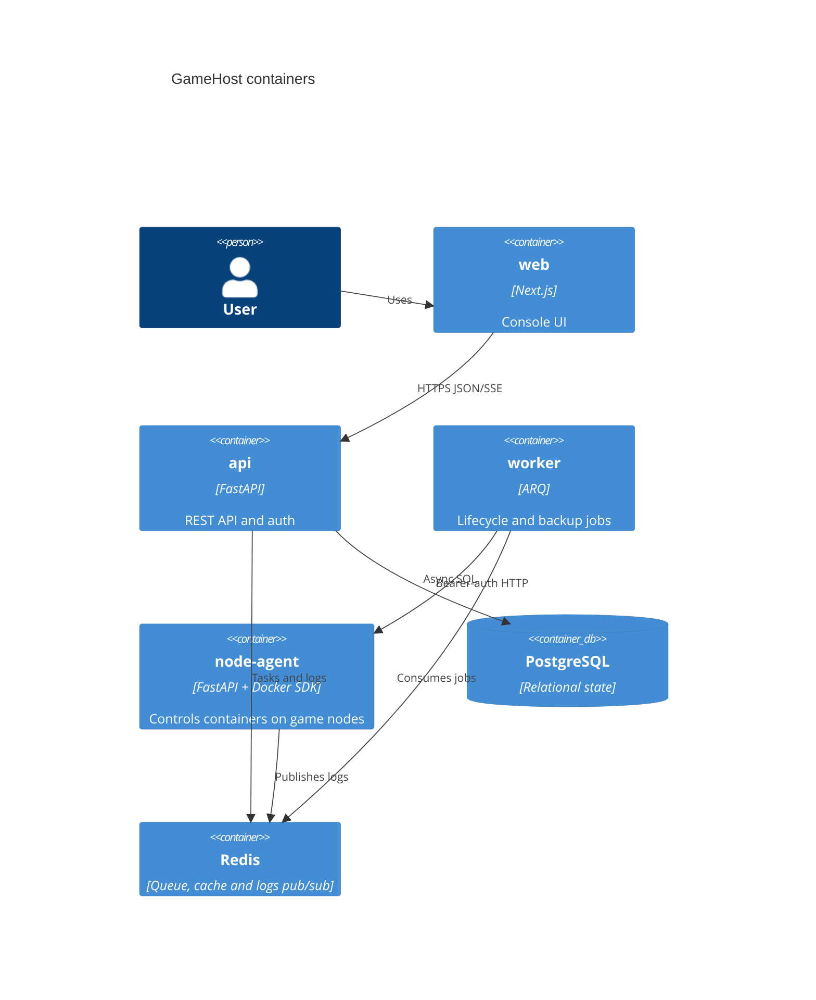

# Architecture

GameHost is a monorepo with four deployable units: public API, worker, node-agent, and web.

The API owns user-facing REST contracts and database state. The worker executes long-running lifecycle tasks. The node-agent is a thin authenticated Docker facade installed on game nodes. The web app uses the public API only.

## Decisions

| Decision | Choice |
| --- | --- |
| Backend language | Python 3.12+ |
| API framework | FastAPI |
| Persistence | PostgreSQL via async SQLAlchemy |
| Queue | ARQ on Redis |
| Node control | Docker SDK inside node-agent |

## C4 Context

## C4 Container

